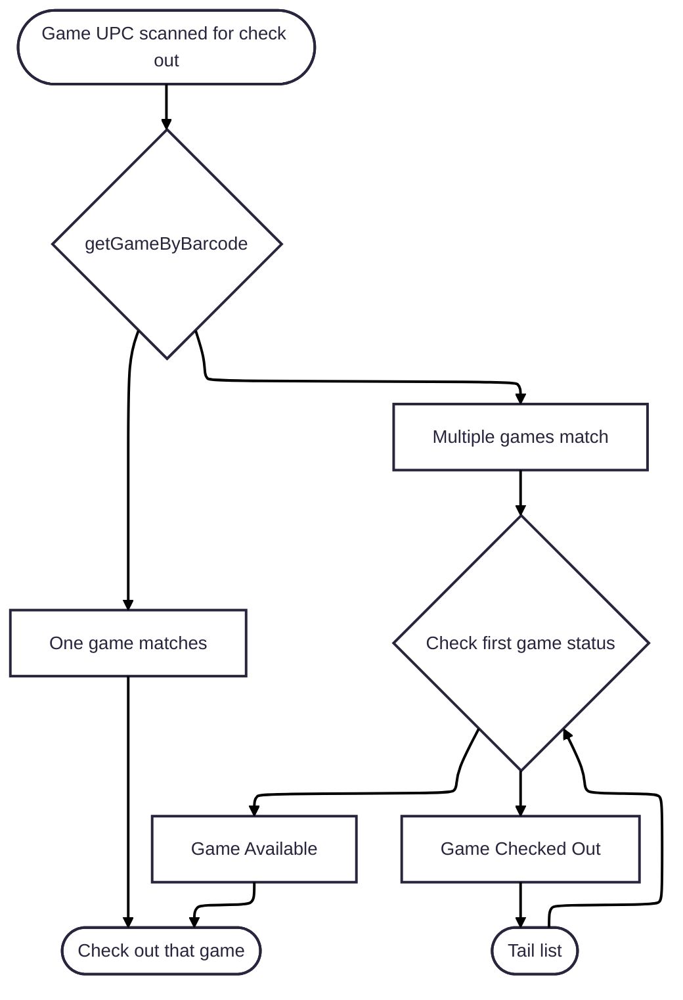
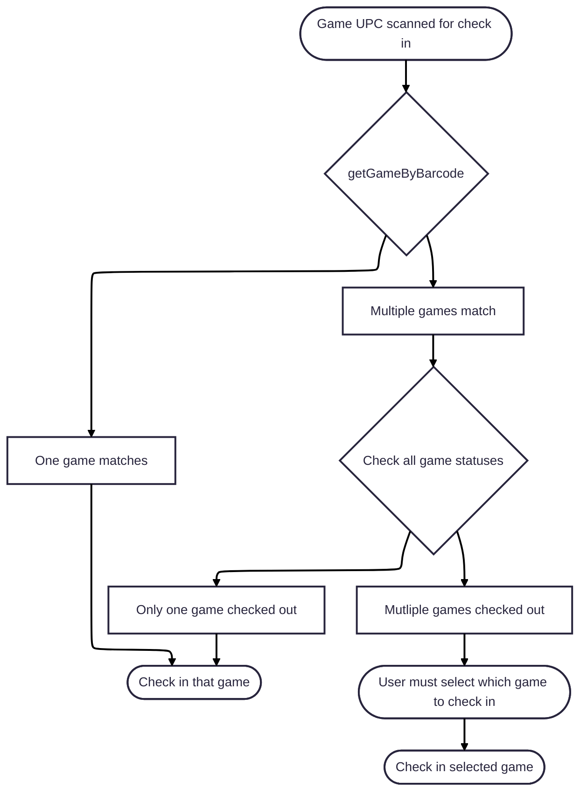

# Barcode Conflict Workflow

This document describes how the system handles UPC barcode conflicts during game check-out and check-in operations.

---

> **Feature Flag**: The entire barcode conflict workflow is only active when `isBarcodeEnabled()` returns `true` (see `frontend/src/lib/config.ts`). All UI elements, conflict resolution modals, and barcode-triggered API calls described in this document must be gated behind that check. If the flag is `false`, the standard manual checkout/check-in flow applies and no barcode logic should be invoked.

---

## Background

The library uses barcodes to identify games and patrons. However, **UPC barcodes are not unique per copy** — two physical copies of the same game will share the same UPC barcode. The library database may therefore contain multiple game records that share an identical barcode value.

This creates an ambiguity problem: when a librarian scans a barcode, the system cannot always determine *which specific copy* of a game is being acted upon.

The `GET /api/v1/library/game/barcode/{gameBarcode}` endpoint is designed to handle this: it always returns a **list** of matching games rather than a single result, and returns `404` (rather than an empty list) if no match is found. The caller is responsible for handling the case where multiple games are returned.

---

## Check-Out Workflow

Check-out is straightforward to resolve automatically. When a librarian scans a game barcode:

1. The system looks up all games matching that barcode.
2. If **exactly one** game is found, proceed with checkout as normal.
3. If **multiple** games are found, the system checks which copies are available (not currently checked out).
   - If **one or more** copies are available, check out the **first available** copy. No librarian intervention is required.
   - If **all** copies are already checked out, the standard conflict response applies (the game is unavailable).
4. If **no** games are found for the barcode, return a `404`.

> **Rationale**: The patron just wants *a copy* of the game. From their perspective, all copies are equivalent. Automatically selecting the first available copy keeps the checkout process fast and unambiguous.

### Check-Out Flow Diagram

---

## Check-In Workflow

Check-in is more complex. When a librarian scans a game barcode to return it:

1. The system looks up all games matching that barcode.
2. If **exactly one** game is found, check it in normally using its transaction ID.
3. If **multiple** games are found, the system checks how many of them are **currently checked out**.
   - If **zero or one** copies are checked out, the system can resolve automatically:
     - Zero checked out: nothing to do (idempotent no-op or informational message).
     - Exactly one checked out: check that copy in without any ambiguity.
   - If **two or more** copies are currently checked out, **manual intervention is required**. The system cannot determine which specific copy is being returned, because those loans are associated with specific patrons. The librarian must identify which patron is returning the game.

### Resolving a Multi-Copy Check-In Conflict

When multiple checked-out copies share the same barcode, the librarian has two options:

- **Scan the patron's barcode**: The system can look up the patron and find their active transaction for that game title, uniquely identifying which copy to check in.
- **Select from a list**: The UI presents the librarian with the list of currently checked-out copies (showing patron name, checkout time), and the librarian manually selects the correct one.

> **Rationale**: Unlike check-out, where any available copy is equivalent, check-in must close a specific transaction. Each loan belongs to a specific patron, so guessing which copy to return would corrupt the transaction history.

### Check-In Flow Diagram

---

## API Endpoints Involved

| Endpoint | Purpose |
|---|---|
| `GET /api/v1/library/game/barcode/{gameBarcode}` | Look up all games matching a barcode. Returns `404` if none found. |
| `GET /api/v1/library/game/id/{gameId}` | Get checkout status for a specific game copy. |
| `GET /api/v1/library/patron/barcode/{patronBarcode}` | Look up a patron by their barcode to resolve check-in conflicts. |
| `POST /api/v1/library/checkout` | Check out a specific game copy to a patron. |
| `POST /api/v1/library/checkin` | Check in a game by transaction ID. |

---

## Edge Cases

| Scenario | Behaviour |
|---|---|
| Barcode matches no games | `404` — inform the librarian the barcode is unrecognised |
| Single match, game available | Normal checkout |
| Single match, game unavailable | `409` — game is already checked out |
| Multiple matches, one available | Auto-select the available copy and proceed |
| Multiple matches, all unavailable | `409` — all copies are checked out |
| Multiple matches, one checked out | Auto-resolve check-in without librarian input |
| Multiple matches, many checked out | Require librarian to identify the patron (scan or select) |
| Patron barcode scanned but patron has no active loan for that title | Display an error; ask the librarian to select manually |

