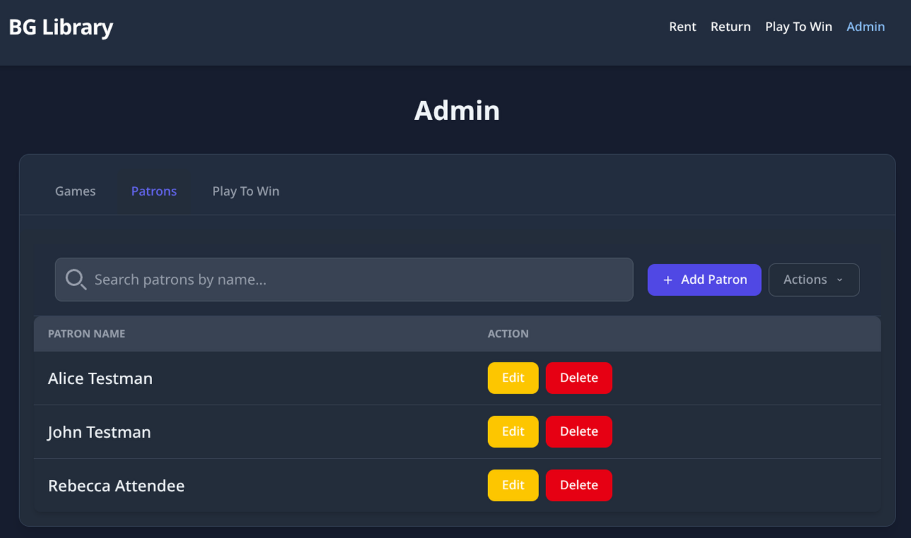
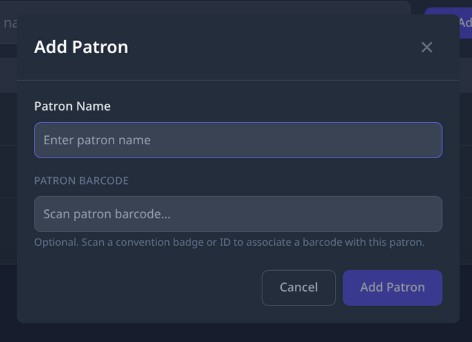

# Adding a Patron

Use this guide when a patron wants to borrow a game but is not yet in the system. You can add them at any time — including right in the middle of a checkout.

---

## Steps

### 1. Open the patron list

<!-- TODO: screenshot — Patrons_Page.png -->

Click the **Patrons** tab at the top of the page — or press **Tab** on your keyboard to move to it, then press **Enter** to open it.

You will see a list of all patrons that have been added to the system.

---

### 2. Open the Add Patron window

Click the **Add Patron** button — or press **Tab** to move to it, then press **Enter** or **Space** to select it.

<!-- TODO: screenshot — Patron_Modal.png -->

A small pop-up window will appear with a field for the patron's name.

---

### 3. Enter the patron's name

Type the patron's full name or the name they would like to go by into the **Name** field.

---

### 4. Save the patron

Click **Save** (or **Add Patron**) to add them to the system.

The patron will now appear in the list and can be found when processing a checkout.

---

## Adding a Patron During a Checkout

If you are in the middle of checking out a game and the patron is not in the system yet, you do not need to leave the checkout screen.

1. In the checkout pop-up window, start typing the patron's name in the **Patron Name** field.
2. If their name does not appear, look for an **Add New Patron** button or link near the field and click it.
3. Enter the patron's name and save.
4. The patron will be added and automatically selected — continue with the checkout from there.

---

## Notes

- Two patrons can have the same name. The app allows this.
- You cannot permanently remove a patron from the system. If a patron record needs to be removed or edited, that is handled by an administrator.
- If a red error message appears at the bottom of the screen and the reason is not clear, ask for help or write down what you were doing so someone can look into it later.

---

*See also: [Renting a Game](rent-manual.md) · [Returning a Game](return-manual.md)*

