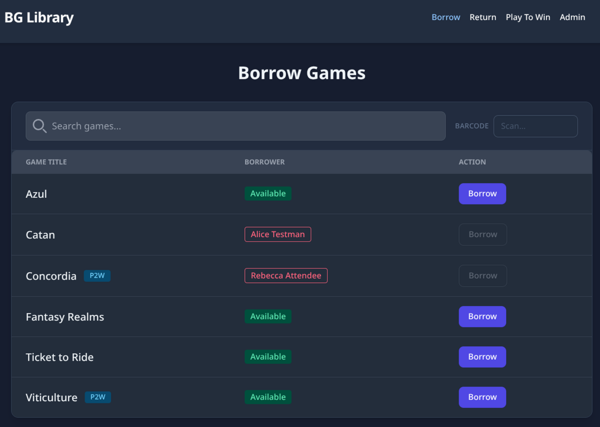
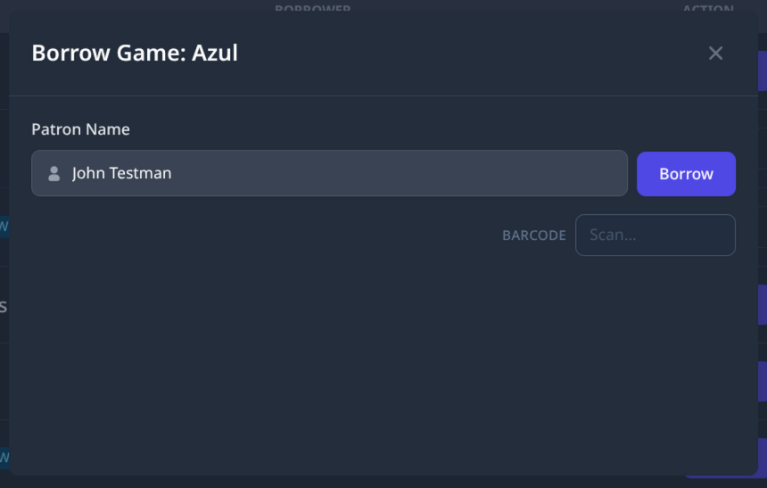

# Borrowing a Game

Use this guide when a patron wants to borrow a game. It walks you through each step, from opening the app to finishing the checkout.

---

## Steps

### 1. Go to the Borrow page

<!-- TODO: screenshot — Borrow_Page.png -->

Select the **Borrow** tab in the navigation bar at the **top right of the screen** — or press **Tab** on your keyboard until **Borrow** is selected, then press **Enter**.

The table shows all games in the library, including ones that are already checked out. This lets you tell a patron whether a game is in the collection, even if someone else has it right now.

---

### 2. Find the game

Type the game's name into the **Search** box at the top of the table. The list will narrow down as you type.

> **Tip:** You do not need to spell the name perfectly. For example, typing `barenpark` will still find *Bärenpark*.

---

### 3. Open the borrow window

Find the game in the results and click the **Borrow** button next to it — or press **Tab** to move to the button, then press **Enter** or **Space**.

<!-- TODO: screenshot — Borrow_Modal.png -->

A pop-up window will appear.

---

### 4. Find the patron

Type the patron's **full name** into the **Patron Name** field. A list of matching names will appear as you type.

- **If the patron's name appears in the list:** Click their name to select it, then click **Borrow** to finish.
- **If the patron's name does not appear:** Go to Step 5 to add them as a new patron.

---

### 5. Add a new patron (if needed)

If the patron is not in the system yet, click the **New Patron** button (labeled "New Patron", shown in green) inside the pop-up window — or press **Tab** to move to it, then press **Enter** or **Space** to select it.

In the **New Patron** window, enter the patron's full name and save. When you are done, their name will be filled in automatically.

Click **Borrow** to complete the checkout.

> **Note:** For full instructions on adding a patron, see [Adding a Patron](add-patron.md).

---

### 6. Confirm the checkout was successful

A success banner (shown in green) will appear at the **bottom of the screen** confirming the checkout was completed. It will close on its own after a moment.

The game will no longer show as available in the Borrow list. The checkout is complete.

---

## Notes

- A game can only be borrowed by one person at a time. If you try to borrow a game that is already checked out, the app will show an error.
- If an error banner (shown in red) appears at the bottom of the screen and the reason is not clear, ask for help or write down what you were doing so someone can look into it later.

---

*See also: [Borrowing with a Barcode Scanner](borrow-barcode.md) · [Returning a Game](return-manual.md) · [Adding a Patron](add-patron.md)*
