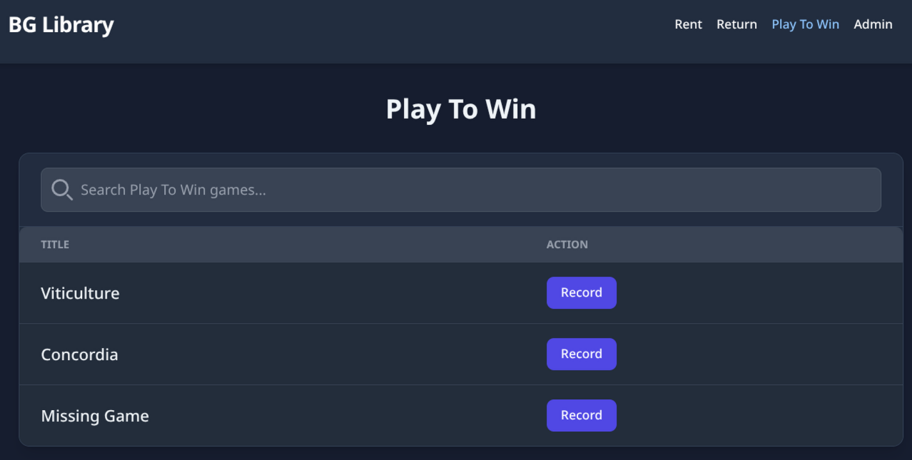
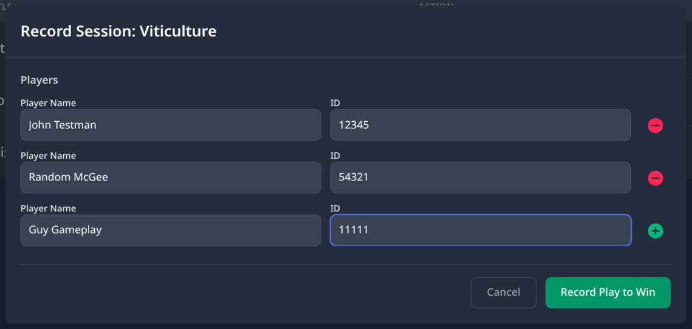

# Recording a Play to Win Session

Use this guide to record who played a game in the Play to Win area. You will enter each player's name and their event ID so they can be entered for a chance to win.

---

## Steps

### 1. Go to the Play To Win page

<!-- TODO: screenshot — Play_To_Win_Page.png -->

Select the **Play To Win** tab in the navigation bar at the **top right of the screen** — or press **Tab** on your keyboard until **Play To Win** is selected, then press **Enter**.

The table shows all games available for Play to Win.

---

### 2. Find the game

Type the game's name into the **Search** box at the top of the table. The list will narrow down as you type.

> **Tip:** You do not need to spell the name perfectly. For example, typing `barenpark` will still find *Bärenpark*.

---

### 3. Open the record window

Find the game in the results and click the **Record** button next to it — or press **Tab** to move to the button, then press **Enter** or **Space**.

<!-- TODO: screenshot — Play_To_Win_Modal.png -->

A pop-up window will appear showing the game title and a **Players** section with one empty row.

---

### 4. Add players

Each row in the **Players** section has two fields:

- **Player Name** — the player's full name.
- **ID** — the player's event ID. This might be a badge number or another ID used at your event. The label on this field may look different at your station.

Fill in both fields for the first player.

To add another player, click the **+** button (shown in green) on the right side of the last row — or press **Tab** to move to it, then press **Enter** or **Space**. A new row will appear.

Repeat until you have a row for every player in the session.

> **Note:** To remove a row you added by mistake, click the **−** button (shown in red) on the right side of that row.

---

### 5. Submit the session

Once all player names and IDs are filled in, click **Record Play to Win** — or press **Tab** to move to the button, then press **Enter** or **Space**.

A success banner (shown in green) will appear at the **bottom of the screen** confirming the session was recorded. It will close on its own after a moment.

The Play to Win session is complete.

---

## Notes

- Players do not need to be in the patron list to be recorded. Any name and event ID can be entered.
- Every row must have both a name and an ID filled in. If any field is empty, the app will show an error banner (shown in red) at the bottom of the screen.
- At least one player row is required before you can submit.
- If an error banner (shown in red) appears at the bottom of the screen and the reason is not clear, ask for help or write down what you were doing so someone can look into it later.

---

*See also: [Borrowing a Game](borrow-manual.md) · [Returning a Game](return-manual.md)*

