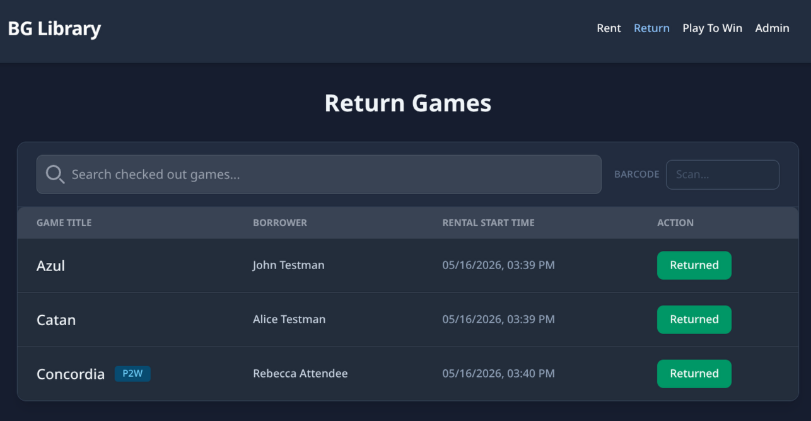
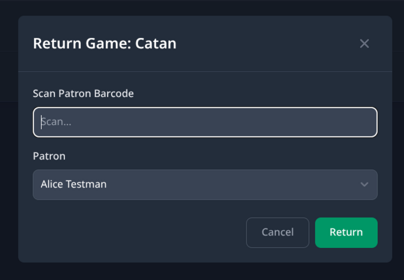

# Returning a Game (Barcode-Assisted Process)

This guide covers how to check a game back in using a USB or Bluetooth HID barcode scanner. Barcode scanning must be enabled in the deployment configuration (`BARCODE_ENABLED = true`).

---

## Overview

The barcode-assisted return workflow lets a librarian scan the game's barcode label to instantly locate and check in the correct copy, eliminating manual searching. When multiple copies of the same title are checked out, the system may prompt the librarian to resolve which copy is being returned.

---

## Prerequisites

- Barcode scanning is enabled (`BARCODE_ENABLED = true` in `config.js`).
- Game copies have barcode labels affixed.
- Patron ID cards with barcodes are available for conflict resolution (recommended).

---

## Step-by-Step

### 1. Navigate to the Return Page

<!-- TODO: screenshot — Return_Page.png (barcode field visible) -->

Open the application and select the **Check In** tab. When barcode support is enabled, a **BARCODE** input field is visible in the toolbar.

---

### 2. Scan the Game Barcode

Point the scanner at the barcode label on the game box and scan it.

**If no element on the page is focused**, the global listener will automatically detect the scan burst, focus the barcode input field, and trigger the game lookup — no clicking required.

**If the BARCODE field is not focused**, click into it first, then scan.

---

### 3. Single Copy — Return Modal Opens Automatically

<!-- TODO: screenshot — Return_Modal.png -->

If exactly one copy of the game is checked out, the **Return Modal** opens showing the game title and the patron it belongs to. Confirm to complete the check-in.

---

### 4. Multiple Copies — Conflict Resolution

If more than one copy of the same game is currently checked out to different patrons, the system cannot determine which copy is being returned from the game barcode alone. A **conflict resolution prompt** will appear.

Resolve the conflict by identifying the returning patron:

- **Scan the patron's barcode ID card** into the dedicated patron barcode field that appears in the conflict modal, or
- **Type or search for the patron's name** manually.

The system will match the patron to the correct checked-out copy and complete the return.

---

### 5. Confirm the Return

Review the game title and patron name shown in the Return Modal, then click **Check In** to complete the return.

The game's status will update to **Available** and the barcode field will be cleared and ready for the next scan.

---

## Barcode Field Behavior Summary

| Situation | What happens |
|---|---|
| No element focused, game barcode scanned | Global listener detects burst → focuses barcode field → triggers game lookup |
| BARCODE field manually focused, game barcode scanned | Scan types into field → `Enter` triggers game lookup |
| Single copy checked out | Return Modal opens automatically |
| Multiple copies checked out | Conflict resolution prompt appears; scan or type patron to disambiguate |

---

## Notes

- The global listener uses an 80 ms inter-keystroke timing threshold. If scanning feels unreliable, click into the **BARCODE** field manually and scan again as a fallback.
- Only checked-out games are visible in the Check In table and lookup.

---

*See also: [Returning Manually](return-manual.md) · [Renting with a Barcode Scanner](rent-barcode.md) · [Adding a Patron](add-patron.md)*

